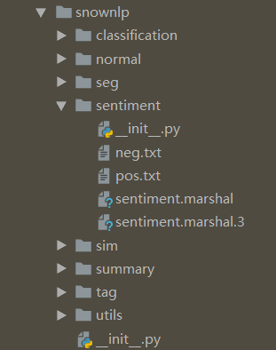
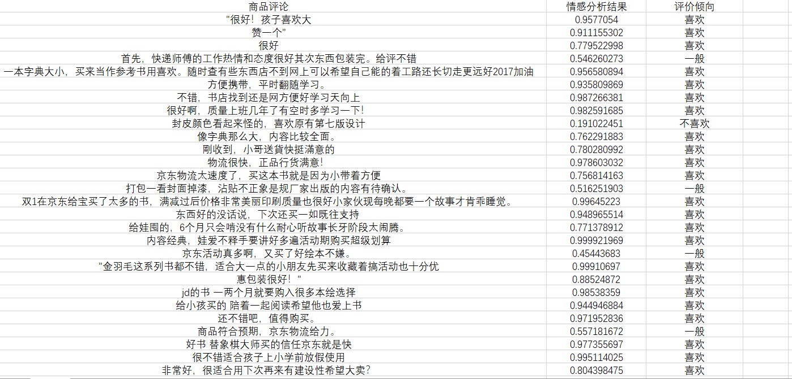
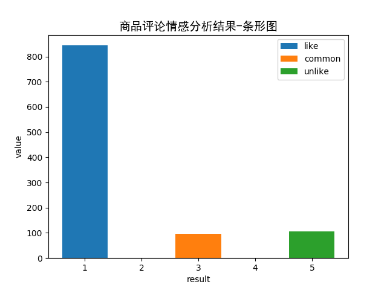
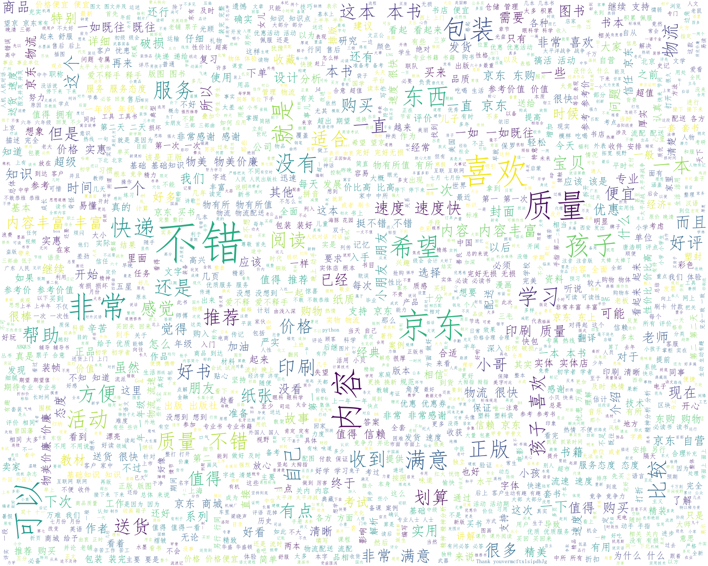

# 😼😽😻Taobao_SentimentAnalysis🤟


## Introduction | 项目简介

抓取淘宝商城随机选取的100部图书的每部书的10条商品评论，共1000条左右，
进行nlp情感分析和简单数据统计分析，并生成商品评论高频词汇词云。

## Download | 项目下载

```bash
$ git clone https://github.com/ElecRex/Taobao_SentimentAnalysis.git
$ cd Taobao_SentimentAnalysis
```

## Requirements

- python 3.7
- requests==2.19.1
- lxml==4.2.5
- pandas==0.23.4
- snownlp==0.12.3
- matplotlib==2.2.2
- jieba==0.39
- wordcloud==1.5.0

## Details | 情感分析流程简析

### 1. 利用snownlp

- 找到下载完毕的```snownlp```位于```site-packages```的位置，如下图：
- 

### 2. 构建简单分词和词性标注

- 部分中文分词如下：

```
新/b 华/m 社/e 北/b 京/e １/b ２/m 月/e ３/b １/m 日/e 电/s 忠/b 诚/e 的/s 共/b 产/m 主/m 义/e 战/b 士/e ，/s 久/b 经/m 考/m 验/e 的/s 无/b 产/m 阶/m 级/e 革/b 命/m 家/e ，/s 我/b 党/e 党/b 务/e 工/b 作/e 和/s 统/b 一/m 战/m 线/e 工/b 作/e 的/s 杰/b 出/e 领/b 导/m 人/e ，/s 原/s 中/b 共/m 中/m 央/e 顾/b 问/e 委/b 员/m 会/e 常/b 务/e 委/b 员/m 会/e 委/b 员/e ，/s 中/b 国/e 人/b 民/e 政/b 治/e 协/b 商/e 会/b 议/e 第/b 四/e 、/s 五/s 、/s 六/s 届/s 全/b 国/e 委/b 员/m 会/e 副/s 主/b 席/e 刘/s 澜/b 涛/e 同/b 志/e ，/s 因/s 病/s 医/b 治/e 无/b 效/e ，/s 于/s １/b ９/m ９/m ７/m 年/e １/b ２/m 月/e ３/b １/m 日/e １/b ０/m 时/e ４/b ４/m 分/e 在/s 北/b 京/e 逝/b 世/e ，/s 终/b 年/e ８/b ８/e 岁/s 。/s
根/b 据/e 刘/s 澜/b 涛/e 同/b 志/e 生/b 前/e 遗/b 愿/e 和/s 家/b 属/e 的/s 意/b 见/e ，/s 刘/s 澜/b 涛/e 同/b 志/e 的/s 丧/b 事/e 从/b 简/e ，/s 不/s 举/b 行/e 
```

### 3. 找到```neg.txt```和```pos.txt```分别为负正向情感数据集

- 我们团队采用公开电商购物评论数据集，并进行训练，
  训练后的模型自动保存到```sentiment.marshal```

### 4. 修改并重构贝叶斯分类器

- 修改```sentiment.marshal```为合适的路径，并利用贝叶斯分类器进行情感分析测试，
  规定将情感分析结果在```[0, 0.4]```范围为不喜欢(差评)，```[0.4, 0.6]```范围为一般(中评), ```[0.6, 1.0]```范围为喜欢(好评)
  ```python
   with open(f'{filename}.csv', 'r', encoding='gbk') as fr:
        for line in fr.readlines():
            s = snownlp.SnowNLP(line)
            if s.sentiments > 0.6:
                res = '喜欢'
                res_list.append(1)
            elif s.sentiments < 0.4:
                res = '不喜欢'
                res_list.append(-1)
            else:
                res = '一般'
                res_list.append(0)
            sent_dict = {
                '情感分析结果': s.sentiments,
                '评价倾向': res,
                '商品评论': line
            }
  ```
  最后的测试结果保存到```result.csv```

## Results | 部分结果展示

- 部分图书商品评论数据展示
  
  ```angular2
  宣传的书本厚度严重缩水!!
  "很好！孩子喜欢！大
  赞一个"
  很好
  首先，快递师傅的工作热情和态度很好，其次东西包装完好。先给好评。不错。
  一本字典大小，买来当作参考书用，喜欢。随时查。有些东西书店买不到，网上可以买到。希望自己能用的着。工作路还长，一切希望能走的更远，更好。2017，加油。
  方便携带，平时翻翻，随时学习。
  不错，书店找不到，还是网店方便，好好学习天天向上
  很好啊，质量很好，上班几年了，有空时多学习一下！
  封皮颜色看起来怪怪的，喜欢原有的第七版的设计
  像字典那么大，内容比较全面。
  剛收到，小哥送貨快，挺滿意的，
  物流很快，正品行货，满意！
  物流太速度了，买这本书就是因为小，带着方便
  打包一看封面掉漆，沾贴不正，象不是正规厂家出版的，内容有待确认。
  双11给宝宝买了太多的书，满减过后的价格非常美丽，印刷的质量也很好，小家伙现在每晚都要一个故事才肯乖乖睡觉。
  东西好的没话说，下次还买，一如既往的支持 东西好的没话说，下次还买，一如既往的支持 东西好的没话说，下次还买，一如既往的支持
  给娃囤的，6个月娃只会啃，没有什么耐心听故事，长牙阶段太闹腾。
  内容经典，娃爱不释手，要讲好多遍，活动期购买超级划算
  活动真多啊，又买了好多好多，绘本不嫌多。
  "金羽毛这系列书都不错，适合大一点的小朋友，先买来收藏着，搞活动买也十分优
  惠，包装的很好！"
  一两个月就要购入很多本 绘本选择很多
  给小孩买的 陪着小孩一起阅读 希望他也爱上读书
  还不错吧，值得购买。。。。。。。。。
  ```
- 部分情感分析结果展示
  

- 1000条图书商品评论的情感分析可视化结果
  

- 1000条图书商品评论的高频词汇词云
  

## License

- MIT license

## Author

- Zijun Xi @2019-9-28
